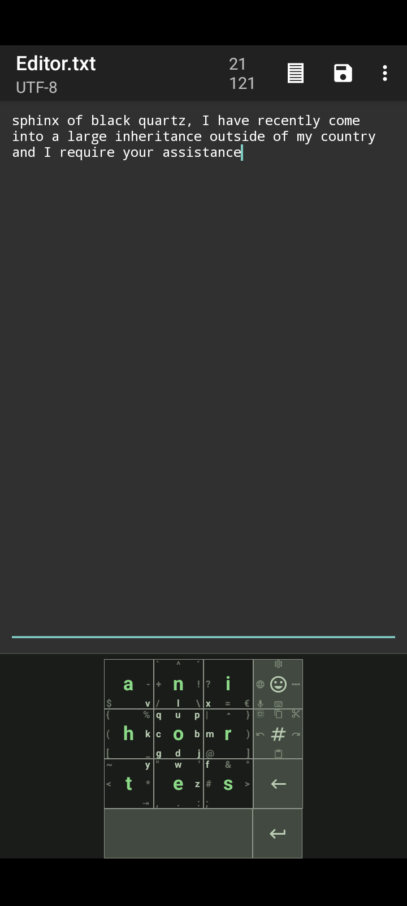

## Thumbkey: a keyboard for your thumbs!

Today I'd like to spotlight a keyboard I've been using since the day I got my first keyless android phone circa 2012. It was a tiny little thing, screen the size of a business card, and they had the nerve to ship it without a numpad or keyboard attached!

Some people worked around this problem by using speech to text, or by using an auto-complete tool like [Swype](https://en.wikipedia.org/wiki/Swype), but I was hip with netspeak and I frequently wanted to type non-words like "doge" and "owo" and "~~\{@" (it's a rose!) and so on. Since these non-words aren't in the dictionary, they won't be filled in with speech-to-text, and the only way to enter them in Swype is to carefully type each symbol by hand on a miniature qwerty keyboard, again only two inches wide.

But I had _Android_, and back in 2012 you could install anything you wanted on an Android phone, it was awesome! These days it's a little more locked down unfortunately, you either need a rooted phone or you need to put up with Google's bullshit. Did you know that you're [not allowed](https://issuetracker.google.com/issues/256669329) to give an app direct access to your Downloads folder anymore? What am I even paying for?

So! The app I installed was called [MessagEase](https://en.wikipedia.org/wiki/MessagEase) and it worked like a charm. It's got these fat chunky 9 buttons and each one is assigned to about 3 letters, which fits the English alphabet very nicely without the need of autocomplete. It might look small in this screenshot but I assure you back when phone screens were smaller I had that thing zoomed way in, and it fit just fine.

So like how does it work? Basically, MessagEase is based on [this research paper](https://www.exideas.com/ME/ICMI2003Paper.pdf) from 2003 by Saied B. Nesbat of ExIdeas, Inc. The original concept was that this would replace other 9-key typing methods on phones. Instead of a variable-width encoding, MessagEase would use a fixed-width encoding, for faster typing. Instead of the old method, where you had to cycle through 3 or 4 options on each key by pressing it repeatedly, the MessagEase method is set up so that every letter is exactly 2 key-presses. So for instance, the letter 'b' would be the center key (5) and then the right edge (6), and you'd remember it as "center-to-right". With the touchscreen app, you don't have to remember the numbers because you can just draw the gesture directly! And if you forget the gestures you can just look at the keys, just like on a physical keyboard. It works great!

MessagEase stopped receiving free updates in February 2024. I'm a little disappointed -- if they'd asked nicely I'd be happy to donate, but I don't want to be held hostage by closed source software... which is why I'm excited to learn that [Thumbkey](https://f-droid.org/packages/com.dessalines.thumbkey/) exists! It's basically a direct clone, but on f-droid, and it's fully customizable. The default layout is a bit different, but I changed mine to match the MessagEase layout that I have twelve years of muscle memory with. I highly recommend giving it a try!

Screens might not be tiny any more but Thumbkey has a second advantage, which is hinted at by the new name: it's for your thumbs! I've found it *way* easier to type one-handed on Thumbkey compared to any other on-screen keyboard. Sometimes people ask how I'm able to text so quickly without speech to text, and yep, this is why! I hope they copy this thing for the Steam Deck too. Come on Valve, it's perfect for your dual touchpads and it would make it way nicer to use chat programs in handheld mode. C'mooooon.
