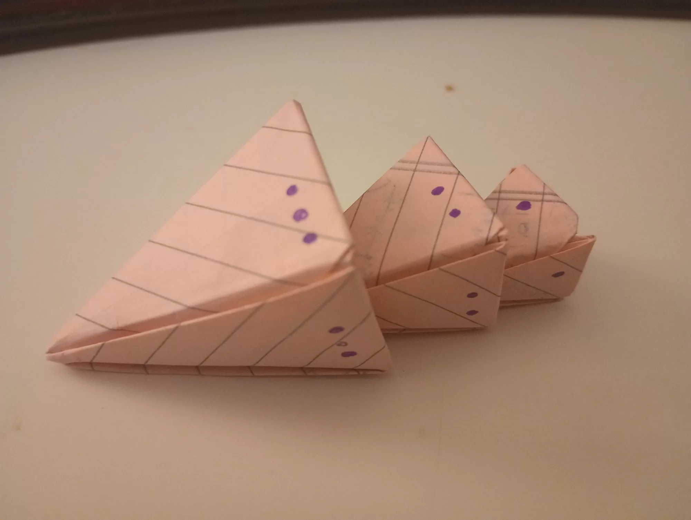
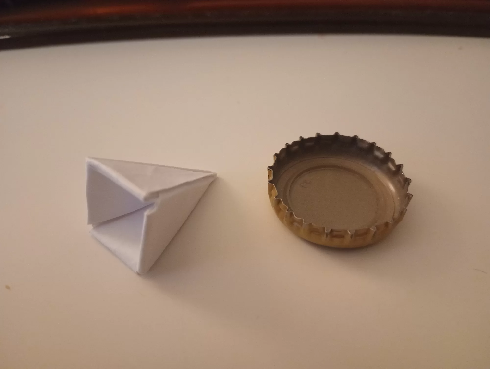
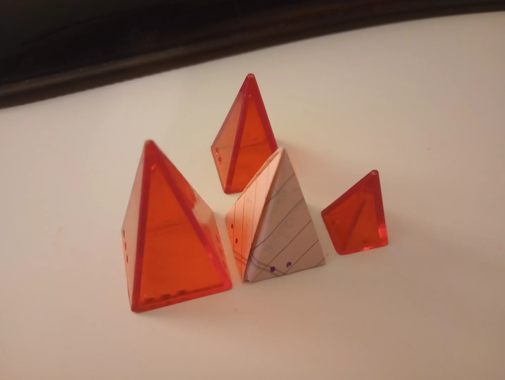
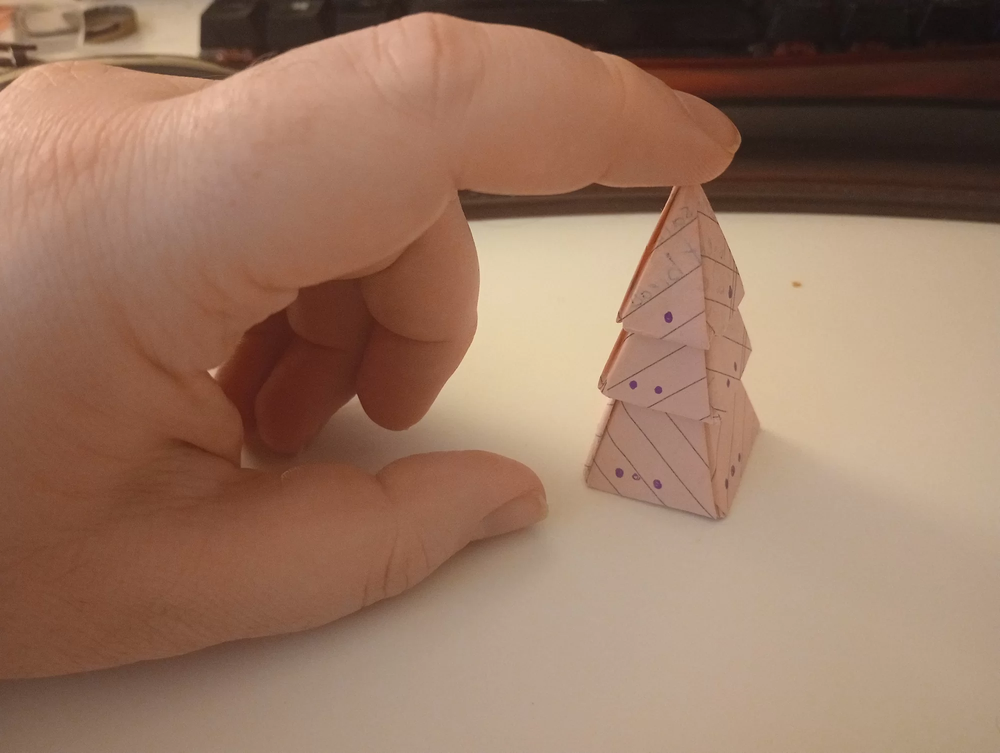


img {
    float: right;
    clear: right;
    width: 400px;
    padding: 10px 20px;
}


So apparently I haven't written about [Looney Pyramids](https://www.looneylabs.com/pyramids-home) yet! Formerly known as Icehouse Pyramids, these were invented by Andy Looney in 1987 as a prop for a science fiction setting for his book [The Empty City](http://archive.wunderland.com/WTS/Andy/EmptyCity/emptycity.html). The game was called Icehouse, and it was meant to be a Martian counterpart to Chess, but "alien" in every possible way:

- The game is for 4 players, with no assigned partners. Diplomacy is allowed but [only once play begins](https://ee0r.com/icehouse/hypothermia/07/default.html).
- Pieces cannot be moved after placing, except in rare circumstances, similar to Go.
- There is no board! The game is played on any flat surface, typically a coffee table. Each player is allowed a small reserve space for their 'out of play' pieces, and *literally everywhere else* is considered 'in play'.
- There are *no turns*. You can move whenever you feel like it. You can make lots of quick moves, or you can wait and make lots of late moves.
- To prevent stalling, there is a timer set to 'about 30 minutes', and placed where nobody can see the remaining time.

These design concepts were ahead of their time in my opinion. Andy Looney and friends, I think they called themselves the 'Wunderland Toast Society', they absolutely changed board gaming in a way we wouldn't see again until James Ernest started Cheapass Games and started selling cut-and-play titles like [Kill Doctor Lucky](https://crabfragmentlabs.com/shop/p/kill-doctor-lucky) in 1996. In fact, whenever a James Ernest game says to use 'tokens of your choice', I always use Looney Pyramids.

Anyway, I had to blog about this because I found Bill Adams' [Origami Icehouse Pieces](https://web.archive.org/web/20050521082358/http://www.iglou.com/biladams/IceHouse/) page buried in the Internet Archive. I've downloaded a local copy in case anything happens to the Archive and I'll probably mirror it at some point [unless he objects](/blog/2024-09-21-01-ethics-of-reuploading/). I'm not sure if he's still around or how to get in touch with him; if you do then let me know.

The pieces are a bit tricky to fold! When he says "fold the corner to the right", you actually have to hold the previous fold in place and fold over it. I should take my own pictures honestly. Right now I just want to show off a few pieces I folded for fun though. Ok bye!
